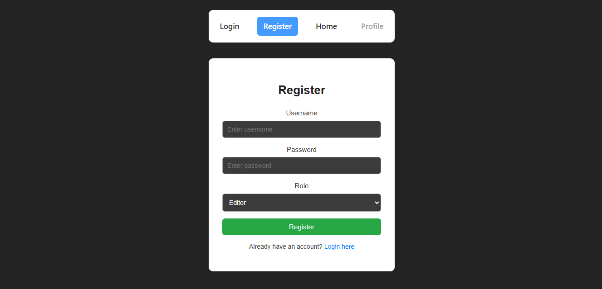
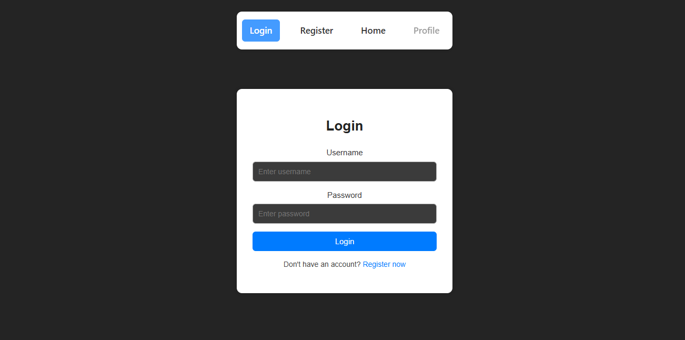
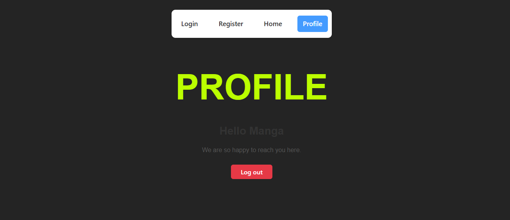

# 📌 React Authentication App

A modern React Single Page Application (SPA) featuring full
authentication, protected routes, navigation, and token-based
verification.\
The app uses **React Router**, **Context API**, and **Access Tokens** to
manage user sessions securely.

## 🚀 Features

- 🔐 User Authentication (Login & Register)
- 🔑 Access Token verification (JWT)
- 🛡️ Protected Routes (`/profile`)
- ⚛️ Global state with **useContext**
- 🔄 Navigation using `Navigate` and `useNavigate`
- 🌐 Connected to backend:\
  **Backend repository:**\
  `(just keep like that, i'll put here the url of the backend repository)`
- 🏡 Four main routes:
  - `/` -- Home\
  - `/login` -- Login\
  - `/register` -- Register\
  - `/profile` -- **Protected**

## 📂 Project Structure

    src/
     ├── components/
     │     ├── Login.jsx
     │     ├── Register.jsx
     │     ├── Home.jsx
     │     ├── Profile.jsx
     │     ├── ProtectedRoute.jsx
     │     └── Navbar.jsx
     │
     ├── context/
     │     └── AuthProvider.jsx
     │
     ├── App.jsx
     └── main.jsx

## 🛣️ Routing Overview

### Public Routes

- `/login`\
- `/register`\
- `/`

### Protected Route

- `/profile` --- available only when authenticated.

## 🛡️ Protected Route Logic

A dedicated component `(ProtectedRoute.jsx)` checks:

- If the user has a valid access token

- If authenticated, it renders the requested page

- Otherwise → redirects to `/login`

## 🧠 Authentication State (useContext)

Authentication state is stored globally using the Context API:

- `logged` → boolean

- `setLogged` → updates state

- Token stored in `localStorage`

- Automatically checked on app load

This allows all components (Navbar, Profile, etc.) to react instantly to login/logout.

## 🔗 Backend Integration

All login & registration requests communicate with the backend:

➡️ [Backend Repo](https://github.com/IsmailMan81F/express-js)

The backend returns:

- `accessToken`

- user data (e.g., username, role)

The frontend stores it securely and uses it for protected requests.

## 🖼️ Screenshots

### 📝 Register Page



### 🔐 Login Page



### 🧍‍♂️ Profile Page (Protected)



## 🏁 Getting Started

### 1️⃣ Clone the repo

```js
git clone https://github.com/IsmailMan81F/react-authentication-service.git
cd react-authentication-service
```

### 2️⃣ Install dependencies

```js
npm install
```

### 3️⃣ Run the project

```js
npm run dev
```

## 📩 Contact

> For questions, improvements, or collaboration, feel free to reach out anytime.
